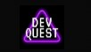

  

<h2 align='center'> Exercises practiced during the frontend development course <a href="https://devemdobro.com/lista/">DevQuest</a></h2>

	

_Para a versão em Português, clique [aqui](#portuguese)._

### Topics

- [Exercises description](#exercises-description)

- [Technologies used](#technologies-used)

- [What I learned](#what-I-learned)

 

## Exercises description

 

### 1st Challenge: Menu with flexbox

- Recreate the menu of a fictional bank following the design guidelines in figma;
- Using flexbox;
- Make it responsive.

 

### 2nd Challenge: List of images with flexbox

- Position the given images according to figma's design guidelines;
- Using flexbox;
- Make it responsive.

 

### 3rd Challenge: Layout with Grid

- Simulate the layout of a video streaming page according to figma's design guidelines;
- Using Grid.

 

## Technologies used

  
  

 

## What I learned

### HTML
- Using the audio tag and how to add audio in the applications;
- Using the video tag and how to add video in the applications. 

### CSS

- Pseudo-classes and pseudo-elements;
- Working with variables;
- Flexbox and Grid.

 

  

<h1></h1>

	

### Tópicos 

- [Descrição dos exercícios](#descrição-dos-exercícios)

- [Tecnologias utilizadas](#tecnologias-utilizadas)

- [O que aprendi](#o-que-aprendi)

 

## Descrição dos exercícios 
	
 
	
### Desafio 1: Menu com flexbox

- Recriar o menu de um banco fictício seguindo as diretrizes do design no figma;
- Utilizar flexbox;
- Fazer o responsivo.

### Desafio 2: Lista de imagens com flexbox

- Posicionar as imagens fornecidadas de acordo com as diretrizes de design do figma;
- Utilizar flexbox;
- Fazer o responsivo.
	
 	
	
### Desafio 3: Layout com Grid

- Simular o layout de uma página de streamming de videos de acordo com as diretrizes de design do figma;
- Utilizar o Grid.

 

## Tecnologias utilizadas

  
  

## O que aprendi

### HTML	
- Uso da tag audio e como adicionar áudio nas páginas;
- Uso da tag video e como adicionar vídeos nas páginas.

### CSS
- Pseudo-classes e pseudo-elementos;
- Trabalhando com variáveis;
- Flexbox e Grid.
	
	

 

Developed with 🧡 by me!  [Carol Vilar](https://www.linkedin.com/in/carolinebarbosavilar/)
